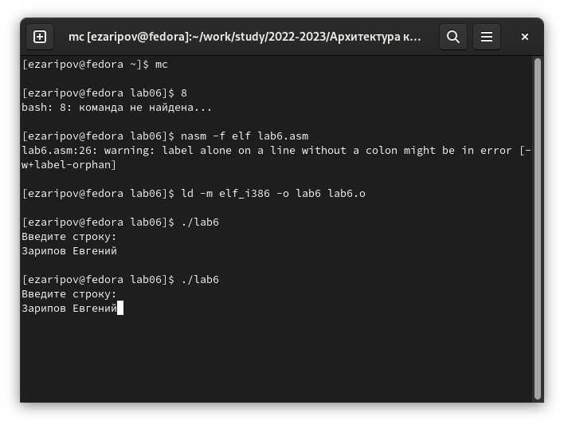
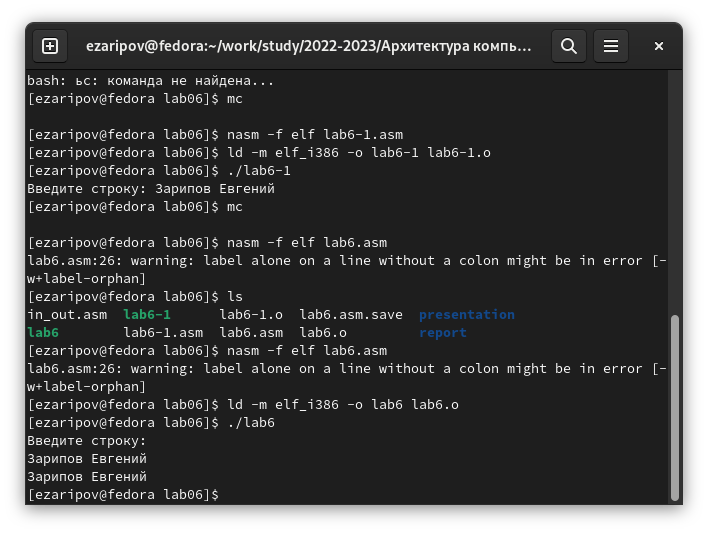

---
## Front matter
title: "Отчёт по лабораторной работе №6"
subtitle: "Дисциплина: архитектура компьютера"
author: "Зарипов Евгений"

## Generic otions
lang: ru-RU
toc-title: "Содержание"

## Bibliography
bibliography: bib/cite.bib
csl: pandoc/csl/gost-r-7-0-5-2008-numeric.csl

## Pdf output format
toc: true # Table of contents
toc-depth: 2
lof: true # List of figures
lot: true # List of tables
fontsize: 12pt
linestretch: 1.5
papersize: a4
documentclass: scrreprt
## I18n polyglossia
polyglossia-lang:
  name: russian
  options:
	- spelling=modern
	- babelshorthands=true
polyglossia-otherlangs:
  name: english
## I18n babel
babel-lang: russian
babel-otherlangs: english
## Fonts
mainfont: PT Serif
romanfont: PT Serif
sansfont: PT Sans
monofont: PT Mono
mainfontoptions: Ligatures=TeX
romanfontoptions: Ligatures=TeX
sansfontoptions: Ligatures=TeX,Scale=MatchLowercase
monofontoptions: Scale=MatchLowercase,Scale=0.9
## Biblatex
biblatex: true
biblio-style: "gost-numeric"
biblatexoptions:
  - parentracker=true
  - backend=biber
  - hyperref=auto
  - language=auto
  - autolang=other*
  - citestyle=gost-numeric
## Pandoc-crossref LaTeX customization
figureTitle: "Рис."
tableTitle: "Таблица"
listingTitle: "Листинг"
lofTitle: "Список иллюстраций"
lotTitle: "Список таблиц"
lolTitle: "Листинги"
## Misc options
indent: true
header-includes:
  - \usepackage{indentfirst}
  - \usepackage{float} # keep figures where there are in the text
  - \floatplacement{figure}{H} # keep figures where there are in the text
---

# Цель работы

Целью данной работы является освоение основного функционала Midnight Commander и инструкций языка ассемблера mov и int.

# Выполнение лабораторной работы

1. Используя команду mc открываю Midnight Commander.

2. В нужном каталоге создаю файл lab6.asm

3. После ввода программы 6.1, транслирую текст программы в объектный файл, выполняю компоновку и запускаю полученный файл

4. C помощью клавиши F6 перемещаю файл in_out.asm в нужный каталог

5. Создаю копию файла lab6.asm с названием lab6-1.asm

6. Исправив код программы, создаю исполняемый файл и проверяю его работу. Заменяю sprintLF на sprint. Различие в двух выводах заключается в отсутствии переноса строки

# Выполнение самостоятельной работы

1. В файле lab6.asm добавляю вывод введённой строки 

2. Создаю исполняемый файл и проверяю корректность работы программы

3. В файле lab6-1.asm добавляю вывод введённой строки

4. Создаю исполняемый файл и проверяю корректность работы программы

# Выводы

В ходе данной работы я ознакомился с Midnight Commander инструкциями языка ассемблера mov и int.
