---
## Front matter
title: "Отчёт по лабораторной работе №8"
subtitle: "Команды безусловного и условного переходов в NASM. Программирование ветвлений."
author: "Зарипов Евгений Сергеевич"

## Generic otions
lang: ru-RU
toc-title: "Содержание"

## Bibliography
bibliography: bib/cite.bib
csl: pandoc/csl/gost-r-7-0-5-2008-numeric.csl

## Pdf output format
toc: true # Table of contents
toc-depth: 2
lof: true # List of figures
lot: true # List of tables
fontsize: 12pt
linestretch: 1.5
papersize: a4
documentclass: scrreprt
## I18n polyglossia
polyglossia-lang:
  name: russian
  options:
	- spelling=modern
	- babelshorthands=true
polyglossia-otherlangs:
  name: english
## I18n babel
babel-lang: russian
babel-otherlangs: english
## Fonts
mainfont: PT Serif
romanfont: PT Serif
sansfont: PT Sans
monofont: PT Mono
mainfontoptions: Ligatures=TeX
romanfontoptions: Ligatures=TeX
sansfontoptions: Ligatures=TeX,Scale=MatchLowercase
monofontoptions: Scale=MatchLowercase,Scale=0.9
## Biblatex
biblatex: true
biblio-style: "gost-numeric"
biblatexoptions:
  - parentracker=true
  - backend=biber
  - hyperref=auto
  - language=auto
  - autolang=other*
  - citestyle=gost-numeric
## Pandoc-crossref LaTeX customization
figureTitle: "Рис."
tableTitle: "Таблица"
listingTitle: "Листинг"
lofTitle: "Список иллюстраций"
lotTitle: "Список таблиц"
lolTitle: "Листинги"
## Misc options
indent: true
header-includes:
  - \usepackage{indentfirst}
  - \usepackage{float} # keep figures where there are in the text
  - \floatplacement{figure}{H} # keep figures where there are in the text
---

# Цель работы

Изучение команд условного и безусловного переходов. Приобретение навы-
ков написания программ с использованием переходов. Знакомство с назначе-
нием и структурой файла листинга.

# Выполнение лабораторной работы

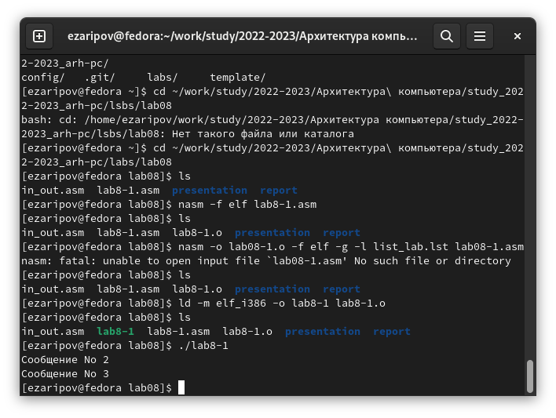
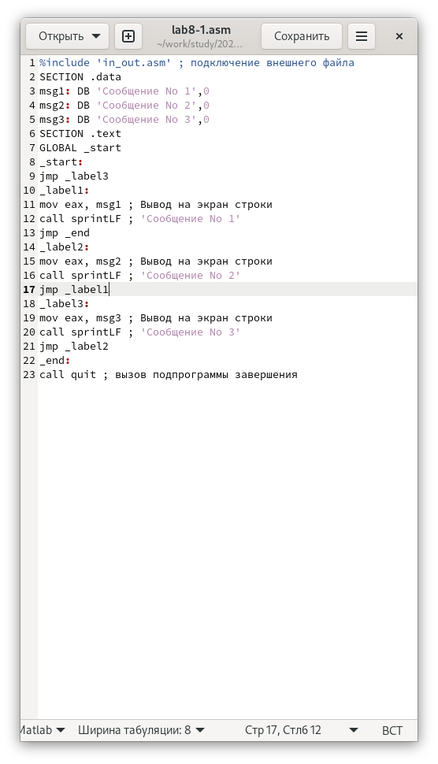
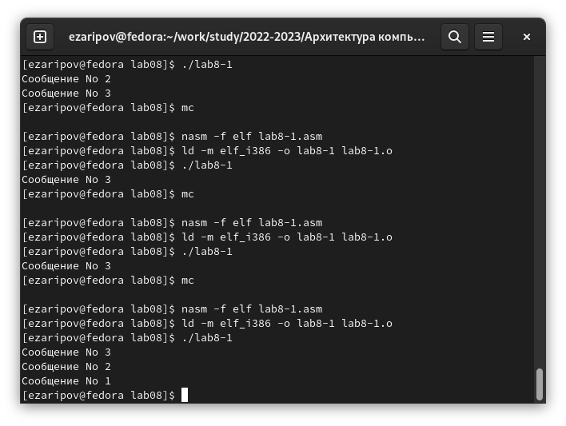
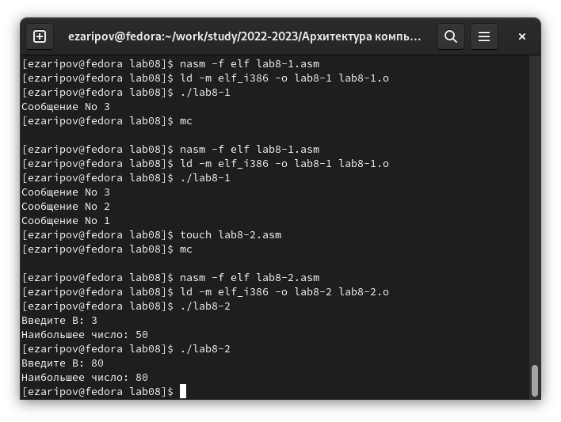
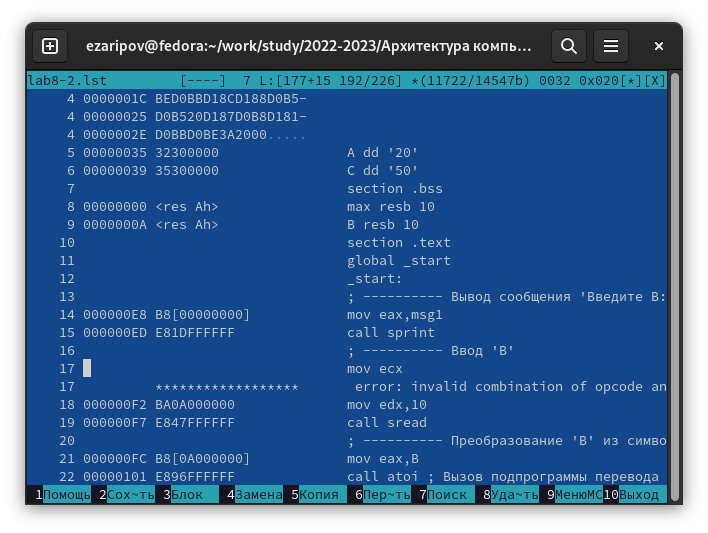

Рассмотрим и опишем некоторые три строчки:
23-я строка: 00000101 (адрес) В80А000000 (машинный код) mov eax, B (в регистр еах вносим значение В)
40-я строка: 00000145 (адрес) 2В0D0A000000 (машинный код)
cmp ecx, B (сравниваем значение регистра есх и значение В)
21 строка: 000000FС (адрес) Е842FFFFFF

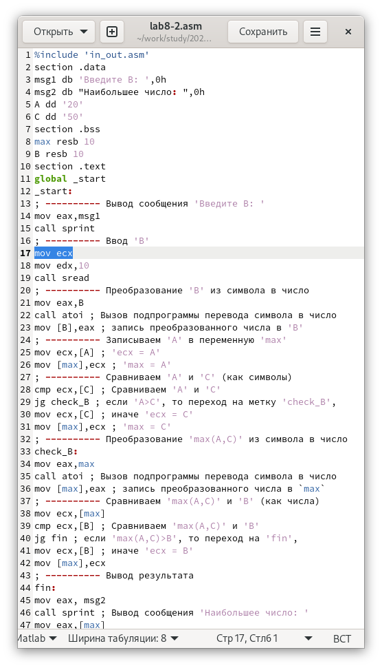
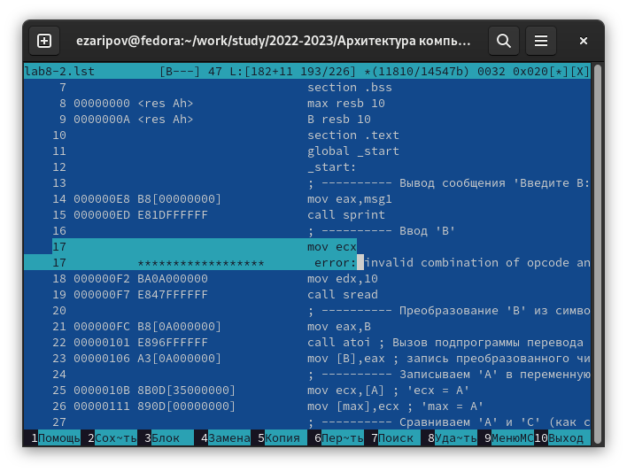

#Задание для самостоятельной работы:

В лабораторной работе я выполнял вариант №6, следовательно в этой лабораторной работе я буду выполнять аналогичный вариант

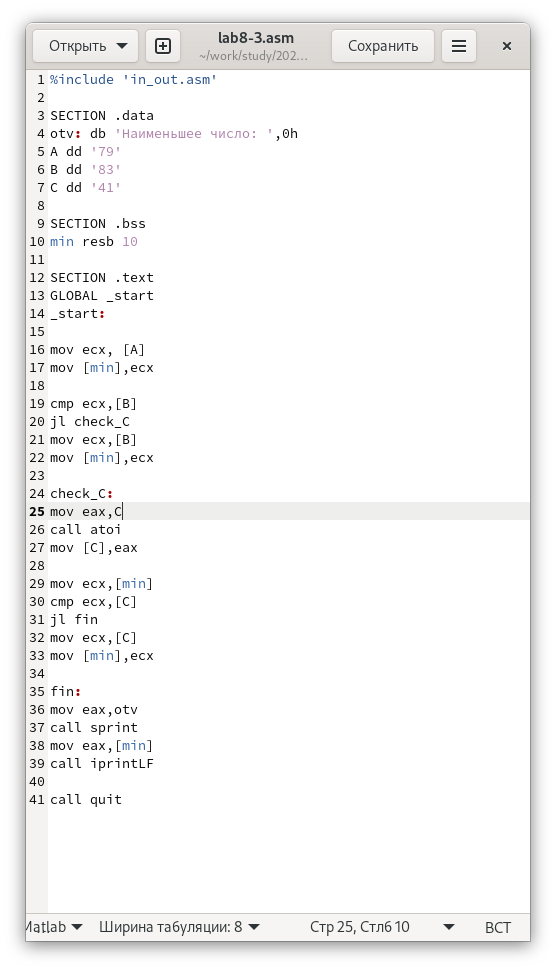
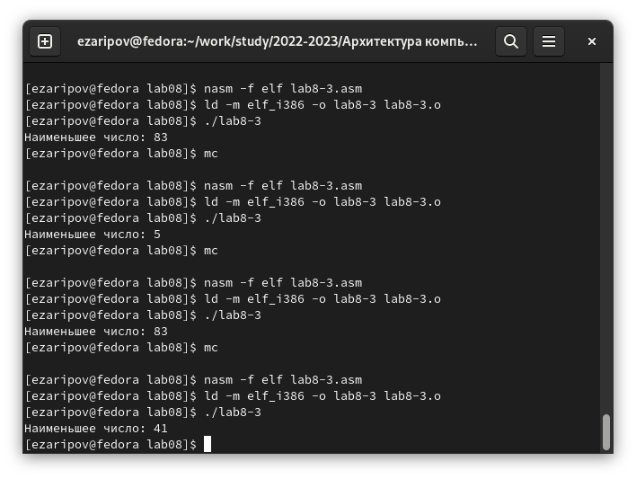

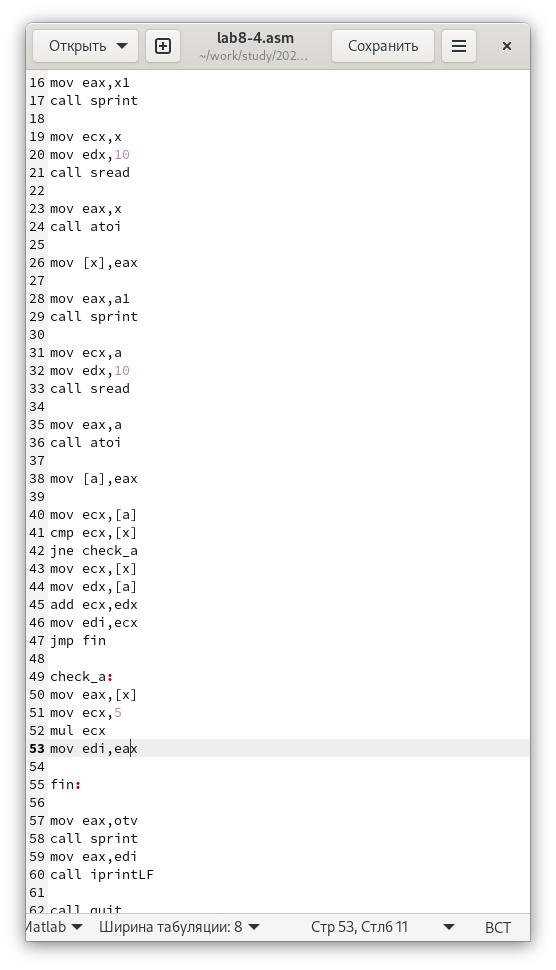
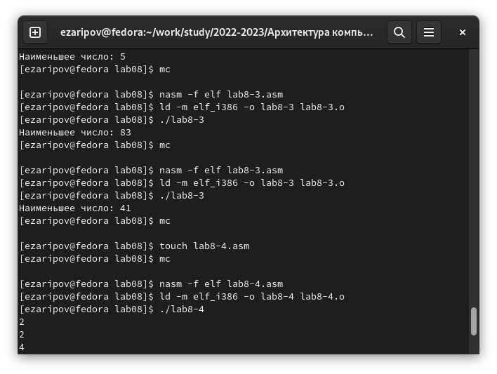

# Выводы

Я изучил команды условного и безусловного переходов. Приобрел навыки написания программ с их использованием. Познакомился с назначением и структурой файла листинга.

# Список литературы{.unnumbered}

::: {#refs}
:::
